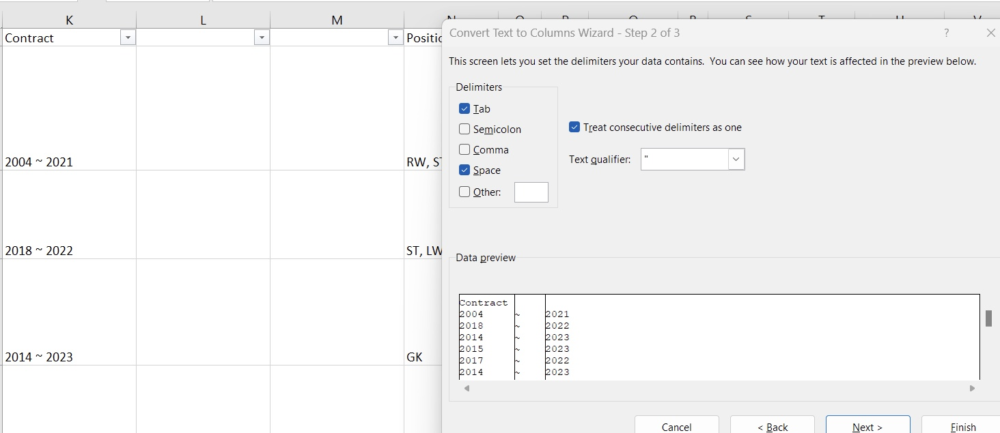

# Fifa-21-Data-Cleaning-Task

FIFA '21 Data Cleaning Process
---

This document outlines the data cleaning process for the FIFA '21 🎮 dataset. The dataset was provided as part of the #DataCleaningChallenge hosted by [Chinonso](@PromiseNonso_) and [V. Somadina](@VicSomadina). The challenge was aimed at pushing data enthusiasts into new territory in data cleaning and analysis while giving them a real-life experience that is different from the classroom.

Objective
---

The goal of this process is to ensure that the FIFA '21 dataset is accurate, complete, consistent, and ready for analysis.

Tools Used
---

For this purpose, MS Excel was used as the initial tool for data cleaning, which provided an awesome experience. After cleaning the FIFA '21 dataset using MS Excel, I’ve also decided to explore the data from a different perspective and attempt to clean it using SQL. The use of SQL will me provide a unique angle to analyze and manipulate the data, enhancing my data cleaning and analysis skills beyond Excel.

Conclusion
---

Overall, the data cleaning process for the FIFA '21 dataset was a challenging yet rewarding experience that helped to improve my data cleaning and analysis skills. The use of multiple tools such as MS Excel and SQL allowed for a comprehensive and thorough cleaning process, resulting in a more accurate and consistent dataset that's ready for analysis.

Dataset Information
---

The FIFA '21 🎮 dataset used in this project was sourced from [sofifa](sofifa.com), a publicly available website for football player statistics. The dataset was originally scraped from [Kaggle]( https://www.kaggle.com/datasets/yagunnersya/fifa-21-messy-raw-dataset-for-cleaning-exploring) and made available as part of the #DataCleaningChallenge hosted by [Chinonso](@PromiseNonso_) and [V. Somadina](@VicSomadina).

The challenge moderators made the dataset available to participants on Telegram and Whatsapp. The dataset consists of player attributes such as age, overall rating, potential, skill moves, and more.

Data Cleaning Process
---

The data cleaning process involved the following steps:

1.	Data Exploration

The first step was to explore the dataset and identify any potential issues. The primary issue noted was the presence of special characters in some names with specialized Spanish characters and the Euro currency symbol. These issues can cause inconsistencies in the dataset and lead to errors in data analysis.

Before Character Encoding              |       After Character Encoding 
:-------------------------------------:|:----------------------------------------------:
                          |                         

2.	Data Cleaning

Once the issues were identified, the data was cleaned using a combination of manual and automated processes. To address the issue of special characters, Excel's Power Query was used to change the character encoding to Unicode UTF-8. Additionally, inconsistent columns were standardized, columns with the star symbols were converted to integers, and values were converted from their short forms (M and K) to their full form in thousands and millions.

3.	Data Verification

Once the data cleaning process was complete, the dataset was verified to ensure that all issues had been resolved. This involved checking the cleaned data against the original data sources and verifying that the data was consistent and accurate. This step is critical to ensure that the cleaned dataset is reliable for further analysis.

4.	Documentation

Finally, the data cleaning process was documented to ensure that it could be replicated in the future. This included documenting the cleaning steps taken, any issues that were identified, and the final cleaned dataset. Documentation is essential for maintaining transparency and accountability in the data-cleaning process and ensuring that others can reproduce and verify it.

Data Cleaning Documentation
---

Data Backup
---

As a best practice, it is always recommended to backup the raw data before beginning any data cleaning process. This is to ensure that in case of any errors or issues during the data cleaning process, the original dataset is still available for reference.

To backup the data, a new sheet within the workbook was created, and a copy of the raw data was pasted into it. This ensures that the original dataset is preserved, and any changes made during the data cleaning process do not affect the original data.

Backing up the raw data provides a safety net and allows for easy comparison between the original dataset and the cleaned dataset to ensure the accuracy of the data cleaning process.

Splitting the Contract Column
---

Before Splitting Contract Column             |      After Splitting Contract Column 
:--------------------------------------------:|:----------------------------------------------:
                                 |                  

To make the contract information more usable for analysis, I decided to split the **"Contract"** column into two columns: **"Contract Start"** and **"Contract End."** This would allow for easier manipulation and analysis of the data.

To achieve this, I used Excel's Text to Columns tool. First, I selected the "Contract" column and clicked on the **"Text to Columns"** button. I selected **"Delimited"** as the option and used space as the delimiter. I then inserted new blank columns where the new data would fall into.

This process split the contract column into two separate columns: **"Contract Start"** and **"Contract End."** The new columns could then be formatted appropriately and used for further analysis. This step helped to organize the data and make it more usable for future analysis.

Then, I deleted the middle column which contains the **~** character as this isn't necessary for my analysis, followed by renaming the columns; from Contract and a nameless column to Contract Start and Contract End.

After splitting the **"Contract"** column into "Contract Start" and **"Contract End,"** I used Excel's Filter tool to check the contents of the new columns. I noticed that the **"Contract Start"** column had some entries with **"months"** in them, even though the column was supposed to contain only years.

To resolve this issue, I used Excel's Find and Replace tool. I replaced each instance of a month in the **"Contract Start"** column with the year 2021, as this was the year indicated at the time the data was created. This ensured that all entries in the **"Contract Start"** column were in the correct format of years.

By cleaning and standardizing the **"Contract Start"** column, the data was now more consistent and ready for further analysis.

Positions 
---

The Positions column was well-structured, but it contained all possible positions of the player in a single column. To make the data more usable, I split this column into three separate columns using the Text to Columns tool. I set my delimiters to space and comma (,) since each player had a maximum of three playable positions.

Height 
---

Upon inspecting the Height column, I discovered inconsistencies in the units used to measure the players' heights. The data contained values in both centimeters and feet and inches (ft in) formats. To standardize the units, I used the Filter tool to display only the heights in ft in format by filtering for the apostrophe symbol (').

Next, I used the Text to Columns tool with delimiters set to Space and apostrophe (') to split the ft values into two separate columns: one for feet and one for inches.

Since I had decided to use "cm" as my standard unit of measurement for height, I used a formula in column R to convert the heights in feet and inches to centimeters. Specifically, I used the formula:

SUM(CONVERT(P795, "ft", "cm"), CONVERT(Q795, "in", "cm"))

This formula converted the heights in column P from feet and inches to centimeters and added the converted values to give the final height in centimeters.

Once the conversion was complete, I cleared the filter on the Height column (P) and ran a Find and Replace to remove the unit "cm" from the values, leaving only integer values in the column.

To merge the converted height values into a single column, I inserted a new column between the P and Q columns (which made the present Q column into R). Using the IF formula, I merged the values of columns P and R (if R wasn't empty) into column Q, which was named "Height (cm)". Then, I copied the values of column Q and pasted them over column P, using the "paste values only" option to avoid carrying over the original height values in feet and inches. Finally, I deleted column Q and the non-valuable columns R and S.

Weight
---

Similar to the height column, the weight column required some cleaning to make it ready for analysis. The data in the column comprised of weight in kg and lbs. So a similar process to the height column above would make it analysis-ready.

---

Value 
---

To prepare the Value column for analysis, I noticed that some values ended with M's and K's to imply millions and thousands. Firstly, I replaced the € sign and created a new conditional column using the formula IF(RIGHT(E2,1)="M",1000000,IF(RIGHT(E2,1)="K",1000,1)). This formula checks if the last character in the Value column cell is "M" or "K" and replaces it with the appropriate multiplier (i.e., 1000000 or 1000).

Next, I changed the data type of the new conditional column to a decimal number. Then, I multiplied the new conditional column by the Value column using the formula =F2*G2. This gave me values in hundreds of thousands and millions instead of decimals and M or K's.

The same procedure was applied to the 'Wage' and 'Release Clause' columns as was used for the 'Value' column.

Data Cleaning Results

---
After completing the data cleaning process, we obtained a polished dataset that was ready for analysis. The final dataset exhibited the following characteristics:

-	No inconsistencies or outliers were found, ensuring the reliability of the data.

-	The dataset was accurate and complete, allowing us to draw meaningful conclusions from the analysis.

-	The data was well-organized and easy to work with, facilitating our exploration and interpretation of the data.

-	Fortunately, the dataset contained only unique values, avoiding any issues of duplicate entries.

Overall, the data cleaning process helped us to ensure the quality and integrity of the dataset, enabling us to derive valuable insights from the data.
